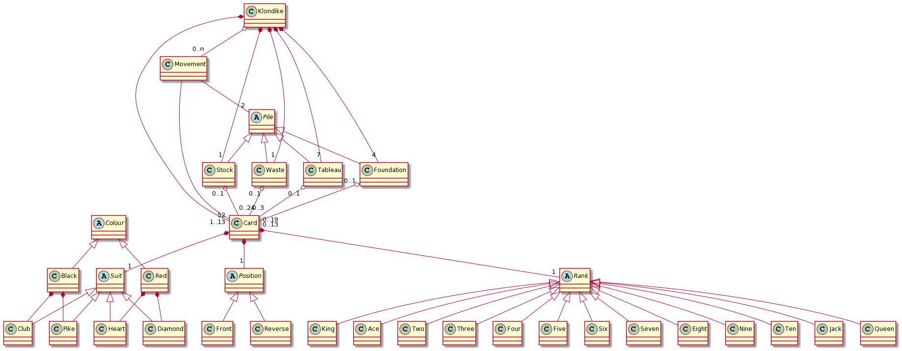
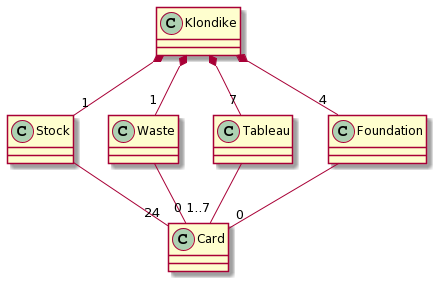
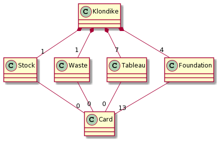
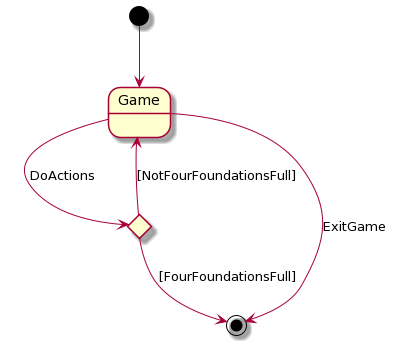
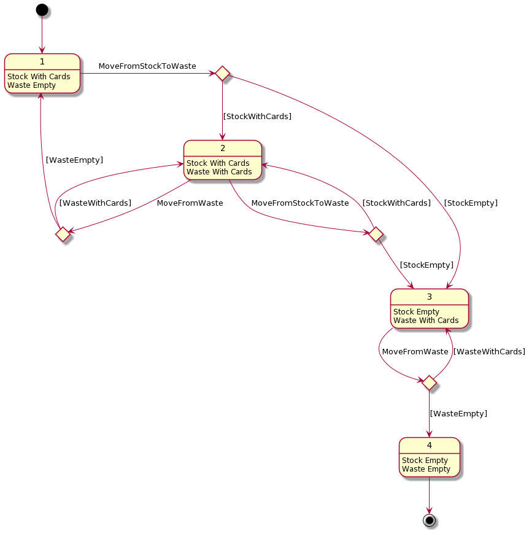
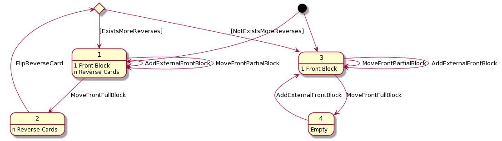
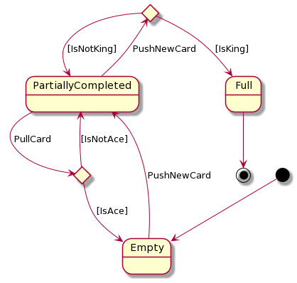
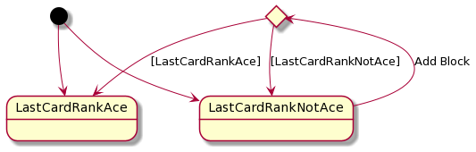

# Klondike
Universo Santa Tecla  
[uSantaTecla@gmail.com](mailto:uSantaTecla@gmail.com)  

## index

* [domainModel](#domainModel)  
    * [vocabulary](#vocabulary)  
    * [initialState](#initialState)  
    * [finalState](#finalState)
    * [instructions](#instructions)  
## domainModel  
  
  

[WIKI](https://es.wikipedia.org/wiki/Solitario_de_cartas)

[Youtube](https://www.youtube.com/watch?v=yjgQXcFVBQY)

### vocabulary

#### Baraja

La baraja empleada en este solitario se corresponde con la baraja francesa sin Jokers. Cada carta viene asociada por un "suit" (palo) y un "rank" (valor).

Posibles suits en la baraja francesa:

Heart: Corazón - Color Rojo
Diamond : Diamante - Color Rojo
Club : Trébol - Color Negro
Pike : Pica - Color Negro 

Posibles ranks en la baraja francesa:

Ace - As (1)
2..10
Jack - J
Queen - Q
King - K

La combinación de 4 suits * 13 ranks dan lugar a 52 cartas. 

#### Pantalla

Stock: Se trata del mazo de cartas boca abajo que se encuentra en la esquina superior izquierda de la pantalla (reverso con las palmeras).

Waste: Se sitúa a la derecha del Stock. Cada vez que accionamos esta sección se muestran 3 cartas, hasta el momento que lleguemos al final del mazo, dónde se mostrarán 2, 1 o ninguna carta. Después puede volver a empezar si en el Stock quedan cartas.

Tableau: 7 pilas de cartas situadas en la parte inferior de la pantalla. Puede encontrarse con de 1 a 6 cartas boca a abajo, una secuencia de cartas boca arriba, ambas a la vez o vacío. Las cartas boca arriba nunca podrán encontrarse por debajo de las cartas boca abajo.

Foundation: 4 pilas de cartas situadas en la parte superior derecha de la pantalla. Cada foundation se corresponderá con cada uno de los suits. Puede encontrarse vacío, parcialmente lleno o completo. 
  
### initialState  
  
 

Al iniciar la partida el mazo del Stock contendrá el máximo de cartas posible (24), el waste estará vacío, en los tableau habrá 28 cartas (1 + 2 + 3 + 4 + 5 + 6 + 7 = 28) y los foundations se encontrarán vacíos.
  
### finalState 

 

Al finalizar la partida con victoria: stock, waste y tableau estarán vacíos y todas las cartas se encontrarán en los foundations.
  
### instructions  

#### Game  
  
 

#### Stock Waste  

#### Tableau

#### Foundation

#### Tableau Push Blocks

 
